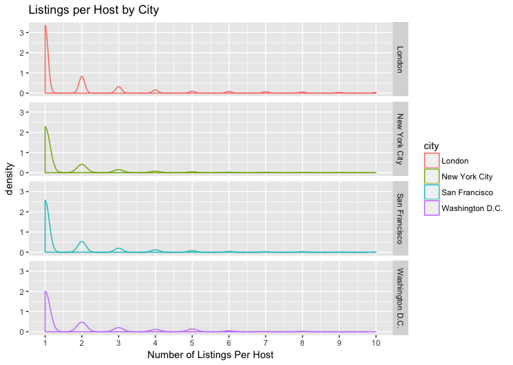

## Team Members

* Brendan Doyle, bjd54
* Sabrina Ma, slm243
* Roger Wang, rw794

## Abstract

Airbnb is an online platform that enables people to lease or rent short-term properties. This project seeks to use data visualization to analyze Airbnb and its effect on large metropolitan cities. Our three research focuses include characteristics of listings and hosts, listing prices by region, and user reviews over time. To explore the first research topic, we created pie and stacked bar charts that display listing by room type, density plots and stacked bar charts that display the distribution of listings per host, and a scatterplot that displays listing availability vs. minimum nights allowed. To explore our second question, we created a Shiny application that maps the price and location of listings in DC, New York, San Francisco, Amsterdam, and London. We mapped size of points to price and color to neighborhood for greater aesthetic detail and made features like region selection and zoom for greater user interaction. Using the `ggmaps` package, we also plots the points on Google Maps. Finally, we investigated our third research topic by creating a time series plot that displays the number of user reviews over time grouped by neighborhood. We also embed this in our Shiny app, which provides an animation feature so users can see dynamically observe change over time. From our visualizations, we discovered that there are in fact indicators of a housing crisis, but Airbnb's impact is probably not as dire as the media portrays it to be. Our map graphs show that listing prices have not drastically increased over time, but there are often some relatively more expensive listings in popular neighborhoods. Finally, our time series graphs show that the frequency of user reviews does vary by neighborhood, which is aligned with our hypothesis that some neighborhoods are "up-and-coming," which may be a signifier of gentrificiation.

## Introduction

Valued at over $30 billion dollars, Airbnb is truly disrupting the hospitality industry. This has led to a contentious debate over Airbnb's role in and affect on housing markets in large metropolitan cities. Proponents of Airbnb say that if Airbnbs were not rented out, they would be vacant. According to [LA Times ](http://www.latimes.com/opinion/op-ed/la-oe-0513-yaffe-airbnb-ordinance-la-20160513-story.html), hosts are "renters who manage to pay their inflated rents on time thanks to income generated by subletting part of their space through Airbnb." On the other hand, opponents say that Airbnb is driving rental prices up and changing the demographic characteristics of neighborhoods that are linked to gentrification. According to [BJH Advisors](https://skift.com/2016/06/28/measuring-the-impact-of-airbnb-rentals-on-new-york-citys-housing-crisis/), a real estate development and advisory firm, Airbnb units that are most likely to contribute to a city's housing crisis include entire apartments/homes rented by commercial hosts who either rented out multiple units for at least three months per year, or had a single listing rented for at least six months per year.

The goal of our final report is to analyze and visualize Airbnb, geographic, and housing data to gain further insight into the different facets of this debate. In particular, our three research areas are listing/host characteristics, rent prices, and frequency of user reviews.

1) What types of places are being rented? How many listings do hosts generally have? Is there a relationship between listing type, count of listings per host, and other variables such as minimum stay and availability?

2) How does median listing price and profitability vary by neighborhood?  

3) How has the number of reviews for listing in up-and-coming neighborhoods changed over time?

## Data

### Data Description

The data we are using is from insideairbnb.com. The data was collected from public data on the AirBnB site through their API. The data sets hold extensive info about AirBnB listings in the DC area. The data contains info about the person who made the listing, the host id, the name of the listing, the neighborhood the listing is in, the latitude and longitude, the type of room, the price, the minimum number of nights you can rent the listing, the number of reviews the listing has, the last time the listing was reviewed, the number of reviews, the number of days out of the year the listing is available, and detailed reviews and listing info. We also will need to use a dataset that maps the neighborhood info to an actual DC map by neighborhood as well as mean rent prices by neighborhood. The data has already been extensively processed by the creators of the insideairbnb website. With that said, that means we have to trust that the creators of the website performed good cleansing of the data and did not make invalid assumptions while doing their processing.

### Data Manipulation

#### Load Data

First, we loaded the listing, neighborhood, and review data for our five regions of interest.

Question Two's Graph required data about listing location and prices grouped by neighborhood. For use in our map graphs, we loaded GeoJSON data for each region. GeoJSON is a format for encoding a variety of geographic data structures. We will merged these datasets with the review dataset to aggregate our data source. To find median listing price by neighorhood, we used `summarise` and `group by` methods.`gCentroid` calculates the center of each neighborhood so we can accurately map them to neighborhood labels.

Question Three's Graph needed to do a summary according to the data, neighbourhood, and number of reviews. Number of reviews needs to be counted from a separate file DC_rev. These two files need to be merged according to the list id. This data manipulaion was handled in the processing necessary to answer question 2.

## Design

### Question 1: Listing and host characteristics

To visualize the types of places that are being rented, pie charts or nightingale plots can be used to display frequency of this categorical variable. However, these graphs only allow us to display data from one city at a time. To compare listing types among multiple regions, a stacked bar chart can also be used with region as the independent variable and proportion of listing type as the dependent variable. These graphs will allow us to see if there is a great proportion of listings are entire houses and/or apartments, which BJH Advisors state may potentially contribute to a housing crisis.

To show the count of listings indidual hosts have, density plots or histograms can be used. Like the pie charts that display listing type, these graphs only allow us to display data from one city at a time. To compare listings per host among multiple regions, we will create separate density plots for each region on the same graph by using `facet_grid()`. These density plots can either be arranged by rows or columns. Hosts with many listings may indicate that they are commercial hosts, which BJH Advisors cite as another effect on the housing crisis.

The relationship between listing type and listings per host can be shown through the used of barplots that segment hosts into those with few, serveral, and many listings. This will allow us to see if hosts with many listings (i.e., potentially commercial hosts) disproportionately rent out entire properties.

Our final design that addresses part A is a scatterplot with listing availability (# days out of the year) as the x variable, minimum nights required stay as the y variable. Dots represent individual There The color of the dots is mapped to listing type. The size of each dot is mapped to the calculated host listing count. There are many variables and aesthetic mappings in this graph. It therefore more exploratory in nature, and hopefully will display a relationship among any of these variables.

### Question 2: Rental prices

To investigate our second research area, we will use geographic and Airbnb/rental price data. This graph will look at listings in a specific region such as Washington DC and display each listing as a `geom_point` object. The color of each point will be mapped to relative price or to neighborhood. Other aesthetic mappings, such as point shape to listing type, can be used for further graph detail. Another iteration of this graph can group listings by neighborhood so listing prices can be examined on an aggregate level. Other variables, such as number of reviews, can also be used. A map of median listing prices can be directly compared with a map of reviews by neighborhood, because it is possible that prices could be higher in neighborhoods that have listings with more reviews.

### Question 3: Frequency of reviews

In order to answer our third research question, we will use a time series plot that shows the count of reviews given for listings in up-and-coming neighborhoods. This will require some data manipulation, including joining the `listings.csv` and `reviews.csv` tables, counting the number of reviews, and grouping by date and neighborhood. Displaying every single neighborhood may make the graph appear too cluttered, so a subset of up-and-coming neighborhoods (i.e., Mission in San Francisco, Williamsburg in Brooklyn) could be selected. Visualizing how the number of reviews for listings in certain neighborhoods have changed over time may indicate their popularity, which could be used to explain urbanization and gentrification.

## Shiny plot

The design of our shiny plot is an extention of the geographic plots used to explore research question part 2 that allows for greater user interactivity. It is comprised of a click and brush-based interative map. The user will be able to use a drop-down menu to select a specific region, such as Washington DC, San Francisco, or Amsterdam. Listings could either be individual points or aggregations by neighborhood. Initially, all the points would be grey. When a user clicks a point, this will change the color of the point as well as display the listing name and price. When a user brushes a group of points and clicks the toggle button, these points will change color and their listing name, price, and room type will be displayed in a table. Graph settings can be reset to default by clicking the reset button. This will allow us to display listing data from multiple geographic regions on the same plot.

## Final Solution

### Question 1

### Question 2

### Question 3

## Conclusion and Analysis

Our first series of graphs show that for most cities, the percentage of spaces that are shared rooms is very small, and entire apartments and private rooms are about a 50/50 split. However, in DC and San Francisco, there are relatively more entire apartments being rented than private rooms. According to the BJH Advisors report referenced in the introduction, these types of listings may exacerbate the affordable housing crisis. This finding is aligned with current news about the effect of Airbnb on the housing market in San Francisco and Washington DC. In light of the concerns over safety and affordability, D.C. council member Kenyan McDuffie recently proposed a bill would make it illegal for property owners to post multiple addresses for rent and limit the rental period for a property to 15 days in a year. According to Claire Zippel, the large propoprtion of entire homes/apartments being rented is a "significant problem considering that about 1,000 District families are in homeless shelters and overflow motel rooms" [The Washington Post](https://www.washingtonpost.com/local/dc-politics/dc-lawmakers-get-an-earful-on-proposal-to-strictly-regulate-airbnb/2017/04/26/594ef9c2-2a92-11e7-a616-d7c8a68c1a66_story.html?utm_term=.d2579c2c42c9). Our density plot displaying Listings Per Host by City and stacked bar plots visualizing Types of Rooms Rented by Host Type also have results (to varying extents) that may be possible housing crisis indicators. In London and DC, there seems to be a bigger number of hosts that are more like landlords or property managers that offer a large number of spaces. For all listings, hosts with 10+ listing have a slightly higher proportion of entire apartments being listed than private rooms.

However, Airbnb's negative impact may not be as dire as it seems. For example, the Listings By Host density plots have a distribution that is skewed right, indicating that most hosts have 1 or 2 properties, so they probably are not commercial property managers. According to the stacked bar charts, the proportional difference between hosts with 10+ listings that rent entire apartments and private rooms is under 10%. This is evidence that Airbnb is probably not the sole contributor to a city's housing crisis, as these are very complex phenomenon with many causal factors.

Our map visualizations displaying listing price by neighborhood were initially very cluttered because we had so much neighborhood/price data but were limited by a static plot. Therefore, we solved this by creating a Shiny application. Because this application has many customizable features, it is meant to be exploratory in nature. Take DC for example. Using the Year slider, users are able to see how listing frequency and price has changed over time in Washington DC. In 2010, there are only a few listings, primarily in the Dupont, U St, and Columbia Heights areas. As time elapses, more and more listings are posted in neighborhoods across DC (except Downtown, presumably because most buildings are corporate offices or government buildings). Listing prices seem to generally fall within the less than or equal to $300 range, but some larger points exist in Dupont, Georgetown, Columbia Heights, and U St.

Our two methods of map projection/representation of listings both have their own strengths and weaknesses. We had several problems using the shape files of cities provided by InsideAirBnB. Because we are using ggplot, there is no adequate method to zoom in on the map in a map coordinate system. We could zoom in using cartesian coordinates, but that heavily distorts the map. The other problem was that labels for neighborhoods could not fit adequately cluttering the map. Ultimately, we used the GoogleMaps API or the ggmap package to solve these problems. By using google maps, we can both zoom in on the map to focus in on specific listings better, and we can change neighborhoods by recentering the map to the selected neighborhood rather than dealing with neighborhood lines and labels. The disadvantage of the google maps is you do not get as good of an overall view of the city as with the shape files. One major overall problem we had with both maps is that we couldn't make specific points clickable because we're constantly changing the available points, but we wanted to be able to make each point clickable so that you could see more information about the listing.

Finally, the shiny app's first and third time series graphs "review over time" and "listing price over time" use `ggplotly` to achieve an amazing effect. You can choose specific line to show and hover your mouse over the line to see details at different points in time. The final version of our graph has the aesthetic mappings and labelling necessary to be an informative graph. It indicates that some listings with the have had an increase in reviews over time, while others have not seen much of an increase. For example, by Sept 2015, listings in Union Station (471 reviews), Columbia Heights (441 reviews), and Capitol Hill (402 reviews) had the greatest number of reviews and a general increase over 2015. However, other neighborhoods such as Friendship Heights, Glover Park, and Takoma Park had under 50 reviews in Sept and didn't see much increase over the year. This is aligned with our hypothesis that some neighborhoods are "up-and-coming," which is a signifier of gentrification. The graph also shows that there is some seasonality in review frequency - across most years, there is a spike in reviews in October for some reason. Some weaknesses of our graph are that `ggplotly` can't create custom labels and the default label's messages are untidy. Because the number of neighbourhoods is large, each line's sample size may be small and can give misleading conclusions. The neighbourhood's location is hard to tell and needs to flip back and forth between the map and this graph to study a specific area.
